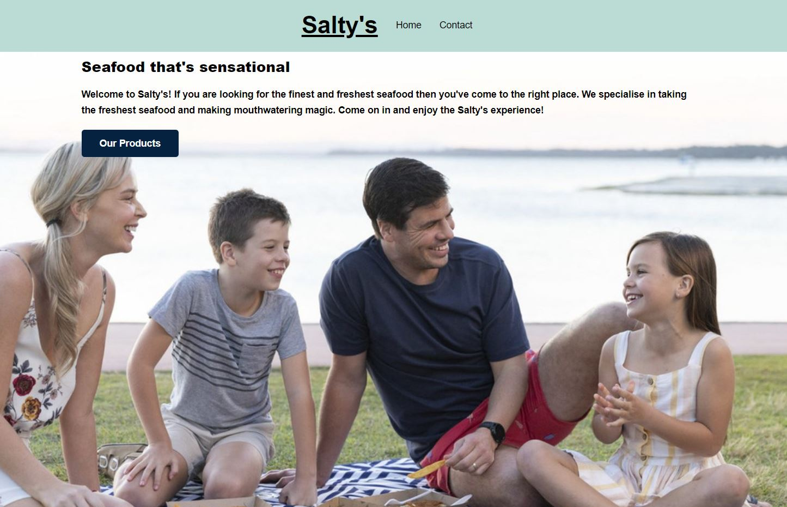

## WD01_Yoobee_Web_Dev_Assignment_1
The building of a website built on HTML and CSS. 

The aim is to apply the fundamentals of HTML,CSS to develop a multiple-page
website.

The website that I built was a 2 page website for a fictitious fish and chip shop in Akaroa a small town on the Eastern side of the South Island of New Zealand. 

The app applies key design principles and the folder structure associated with a clean website design. 

The website covers:
<ul>
  <li>typography</li>
  <li>folder structure</li>
  <li>syntax</li>
  <li>navigation</li>
  <li>testing</li>
  <li>responsive web design</li>
  <li>valid BEM CSS</li>
  <li>Use of CSS and Flexbox</li>
  <li>the use of pseudo classes</li>
  <li>the use of pseudo elements</li>
  </ul>
  
  ## The deliverables
  
  <ul>
  <li>The project uploaded to a GitHub repository</li>
  <li>the hosting of the project on Netlify</li>
  <li>the submission of the source code and other documents to our professor</li>
  </ul>
